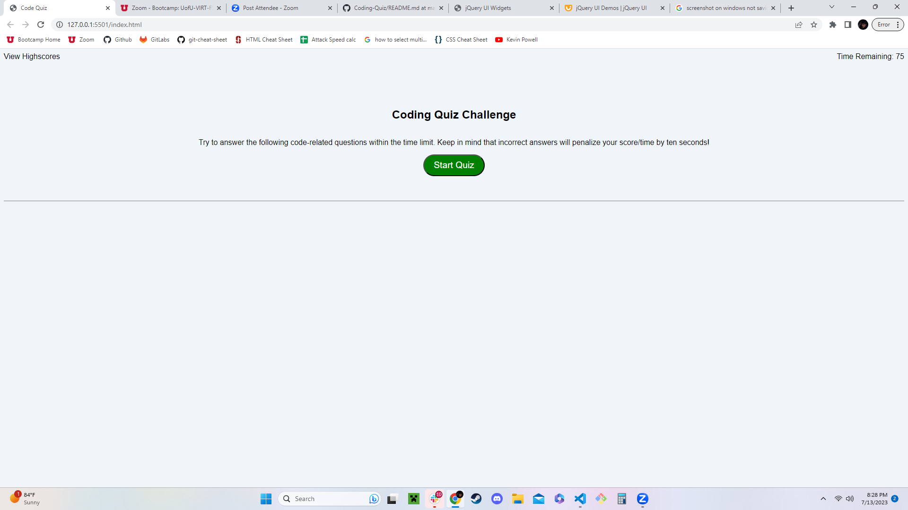
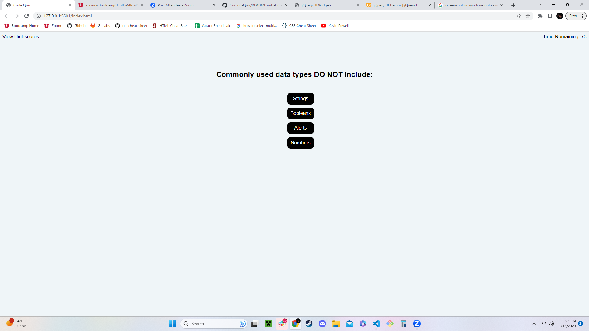
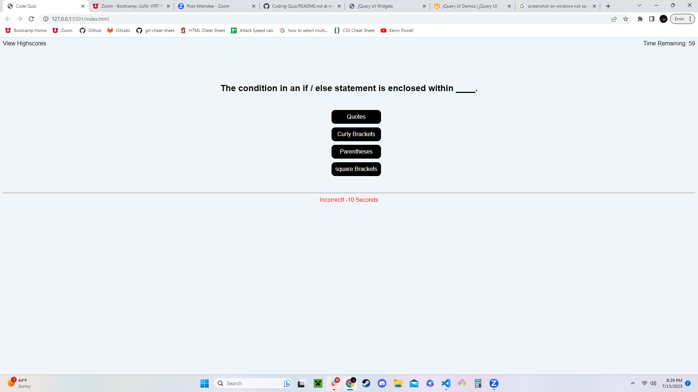
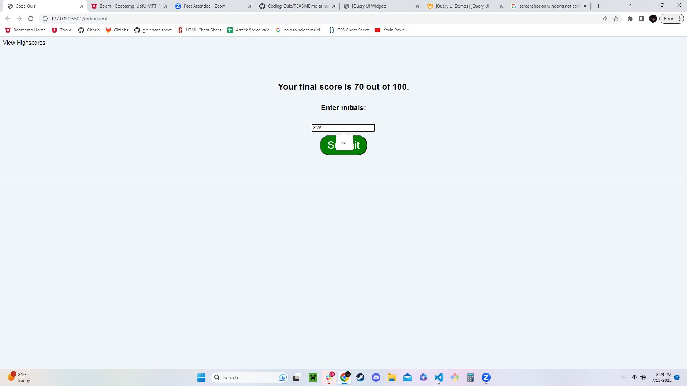
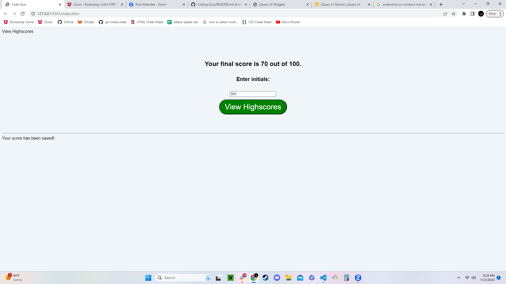
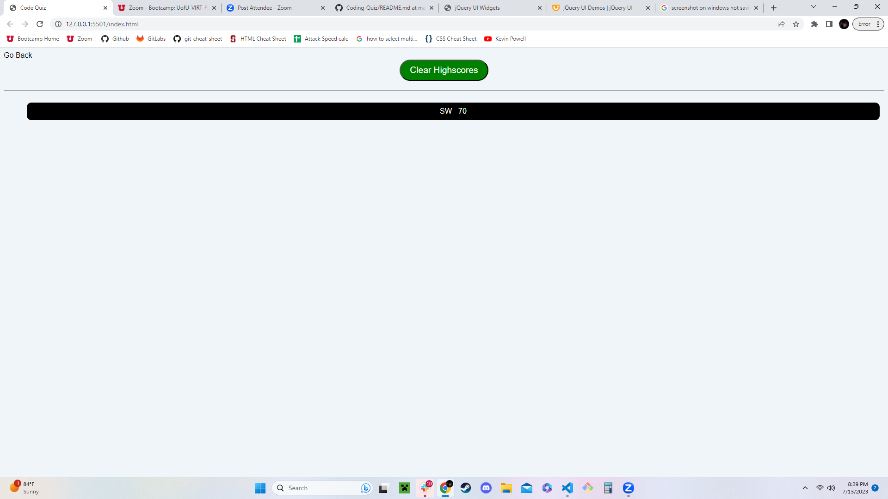
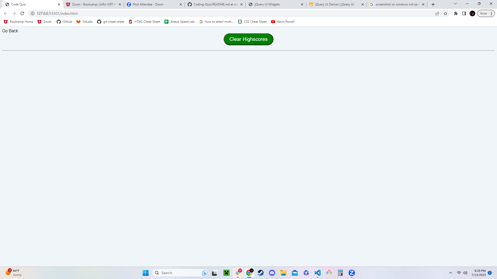

# Coding-Quiz

## Description

The purpose of this project was to create a website that provides the user with a quiz that you can interact with via Javascript.
I built it to allow a user to take a short quiz that tests knowlege on several questions regarding vocabulary words that come up in web development.
Throughout the course of creating this website I learned many of the practical applications of javascript and ways to allow the user to interact with my websites.

## Installation

N/A

## Usage

To begin the quiz click the stary button.

After you begin, the 75 second timer will begin and you will have to answer 5 questions within that time to complete the quiz.

Whenever you answer incorrectly you will have 10 seconds subtracted from your timer.

Once you complete the quiz or run out of time you will have the opportunity to save your score to the local storage of the browser along with your initals.

After submitting your score by clicking view highscores either in the top left corner or the button in the center of the screen.

After cicking on view scores you will see your score with your initials listed.

If you click clear scores it will clear the saved score from local storage and disappear from the screen.

## License

Refer to LICENCE in repo.
